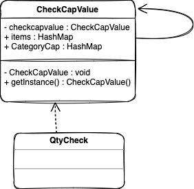
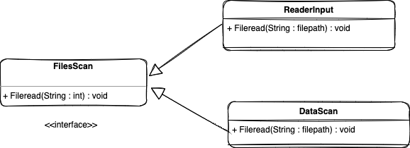
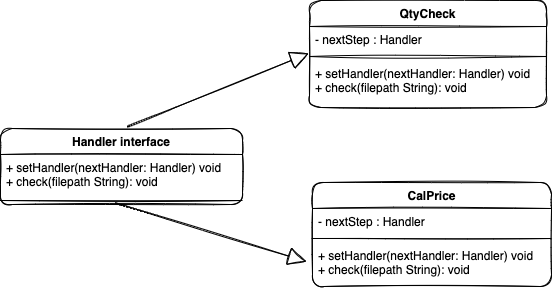
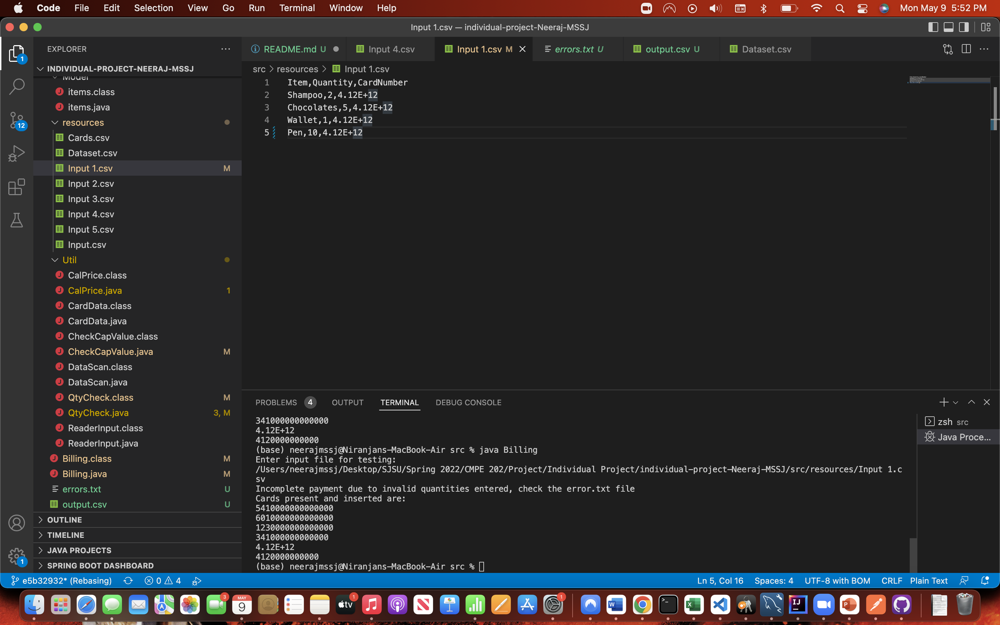
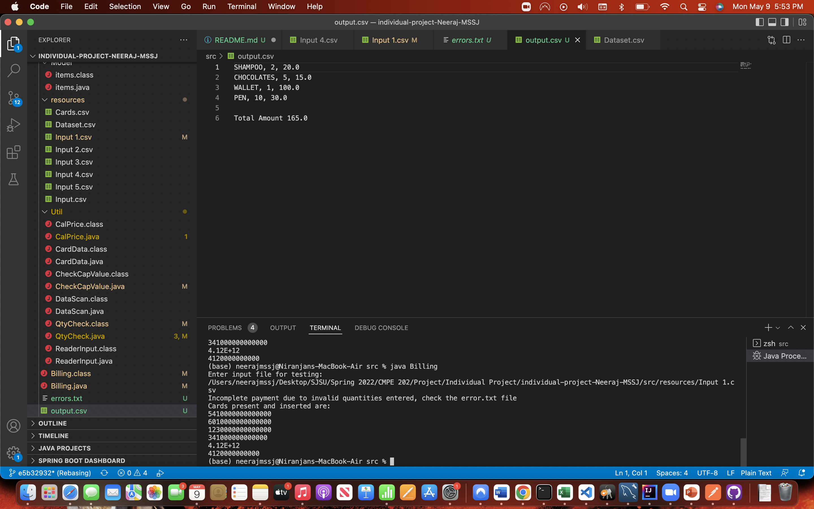
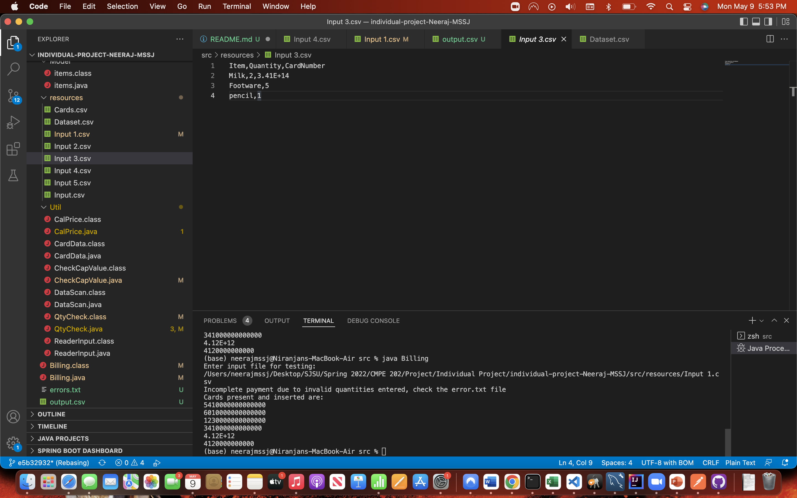
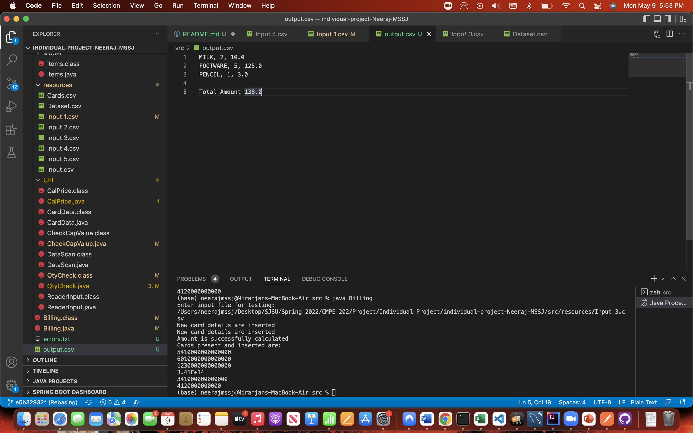
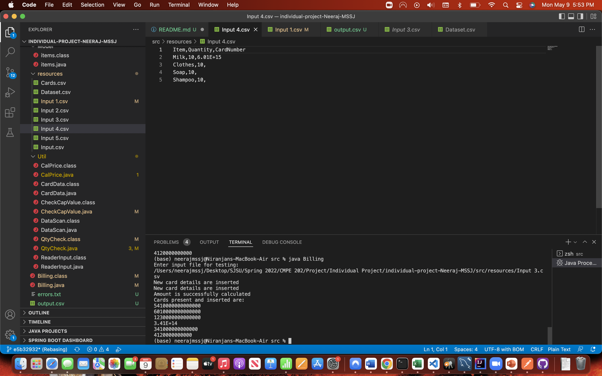
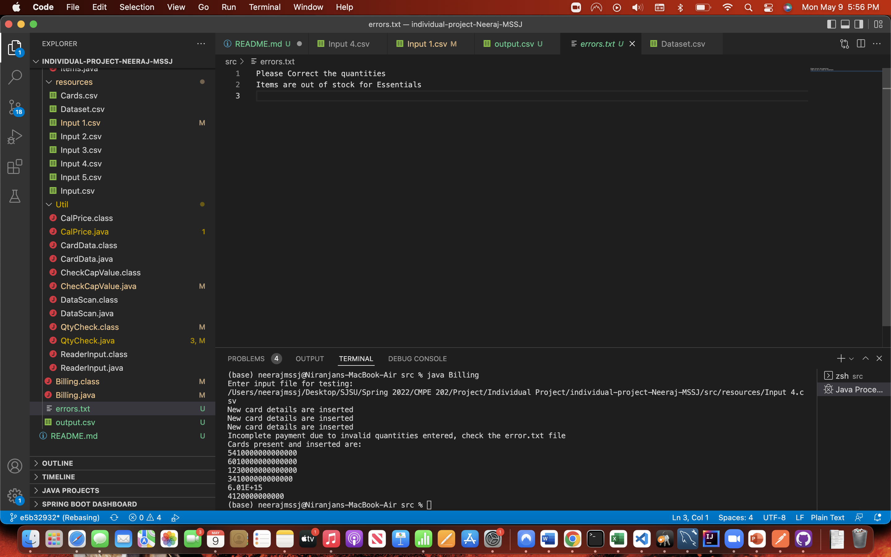

# individual-project-Neeraj-MSSJ

Name: Niranjan Reddy Masapeta
Student Id: 015748122

individual-project-Neeraj-MSSJ created by GitHub Classroom

# Problem Statement:

To implement a grocery mart java application that allows users to add and purchase products. 

# Steps to be followed to run the application:

1. Clone the repo to your folder.
2. Open the folder in IDE.
3. Execute the following commands in /src folder: javac Billing.java and java Billing.
4. Enter the path of your input file.
5. Output.csv file will be generated in /src folder which has total price and an error.txt file is generated with logs.

# Design Patterns implemented in the application:
 * Singleton Pattern
 * Chain of Responsibility
 * Factory

## Singleton :

The pattern ensures that a single class is responsible for creatinf only one object and provides a way to access the object directly without needing intitiation of the class object. In our application, Singleton is used to cap values for categories i.e. Essential, Luxury and Misc. getInstance() method is used to obtain the cap values.

      

## Chain of Responsibility :

The pattern ensures that a request from the client is passed to a chain of objects to process them. The object in the chain will decide the the order of chain and whether the request needs to be passed down the chain or not. Chain of Responsibility is used to validate the quantity and price of the product in a chained process. After the quantity and cap is validated, total price will be calculated.

## Factory :

The pattern provides an interface which allows subclasses to change the type of objects in the superclass. Factory is used to read the input file and dataset. InputReader reads the input files and ReadData class reads dataset file when Handler determines which class to read.

# Test Cases

Note: The cap value are set as follows, 
Essentials: 20, Luxury: 10 and Misc: 10.

## Testcase1:

## Input

## Output

## Testcase2:

## Input

## Output

## Testcase3:

## Input

## ErrorLog
